# The core app

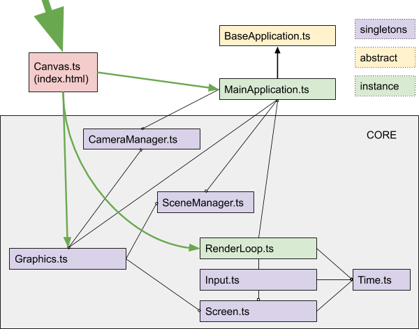

Canvas -> initialize everything when the canvas is ready in the scene then everything else can be created. It initializes graphics and renderloop and mainapplication

CameraManager -> singleton to be called anywhere in the app, for example, if we want to move where the camera is pointing from somewhere else

Graphics handles the WebGL initialization and the scene rendering. I can also do postprocessing if needed

BaseApplication is an abstract class, if more than one application will be created, that might use similar objects and methods, it can be done by subclassing this abstract class.

MainApplication is an application, it instantiates the main object to be used in the app. It can set up the scene, lighting an main object.

SceneManager keeps a reference to the main scene to be used. It can also support multiple scenes when layering is required.

RenderLoop it what updates the time, update the inputs, the application, and to call the scene rendering.

Input registers the events and makes them publicly for the rest of the application. (it might need a reference to the scene)

Screen is a storage of the HTML canvas’ size, render buffer size, aspect ratio, and DPR value.

Time saves the times since the app starts and the delta time between frames (used in animations). It takes this time from the Engine

The rest of the application will be at the same level as the Main Application-

# The Folder Structure

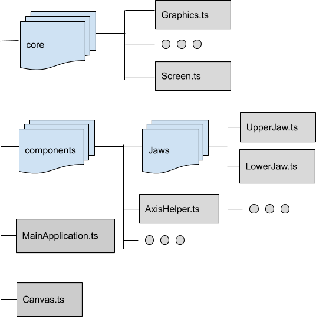

# The FriendlyMesh/Triangulation Structure

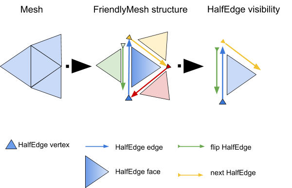

The Halfedge Data Structure is based on The Halfedge Data Structure article[[1]](#ftnt_ref1). The FriendlyMesh structure is a triangulation of the basic mesh Babylonjs provides. Babylonjs structures their meshes using triangle buffers. These buffers are quite optimized for rendering, but not for geometry manipulation. HalfEdge is a simple structure that lets you traverse a mesh in a quite straightforward fashion. This simple structure also makes it very compact and lightweight, saving memory and computing time.

The HalfEdge structure is made by

- A vertex
- The flip HalfEdge
- The next HalfEdge
- The face of the current HalfEdge
- and ID, the position they are in the FriendlyMesh HalfEdges array.

The Face structure is made by

- A link to their three HalfEdges
- Its normal vertex
- Its center vertex
- and ID, the position they are in the FriendlyMesh faces arrays

The Vertex used are part of the Babylonjs classes

The FriendlyMesh structure is then made by

- A list of Vertices
- A list of Faces
- A list of Halfedges

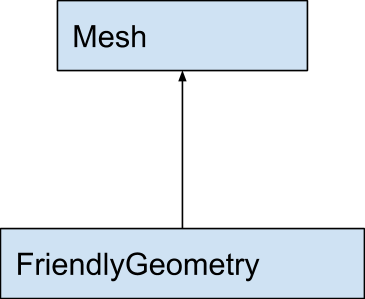

# Command Pattern

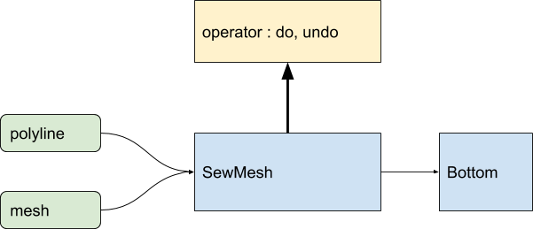

# Project Loader

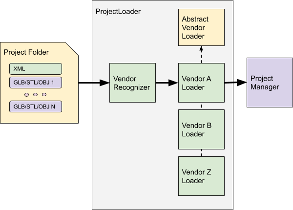

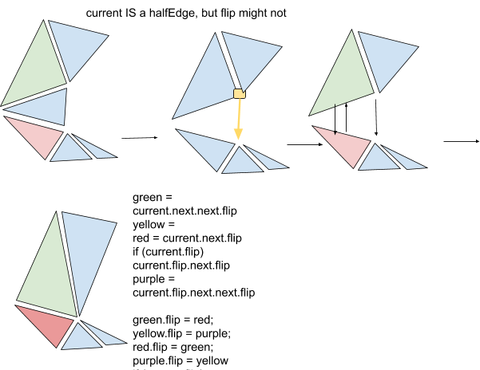

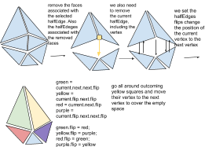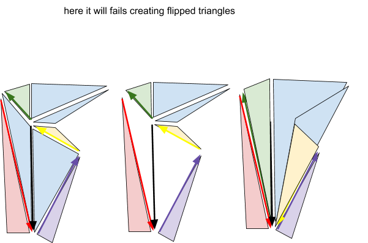

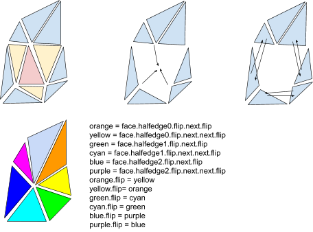

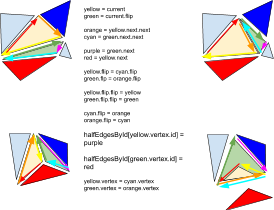

Fins removal

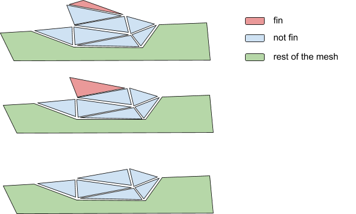

---

[[1]](#ftnt_ref1)https://www.graphics.rwth-aachen.de/media/openmesh_static/Documentations/OpenMesh-6.3-Documentation/a00010.html
