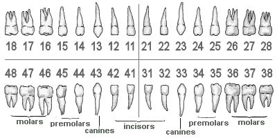
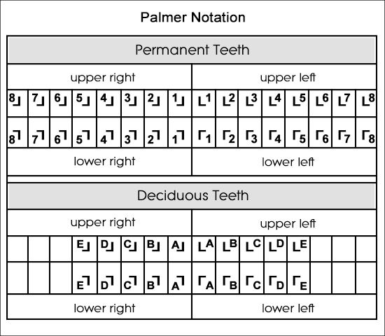
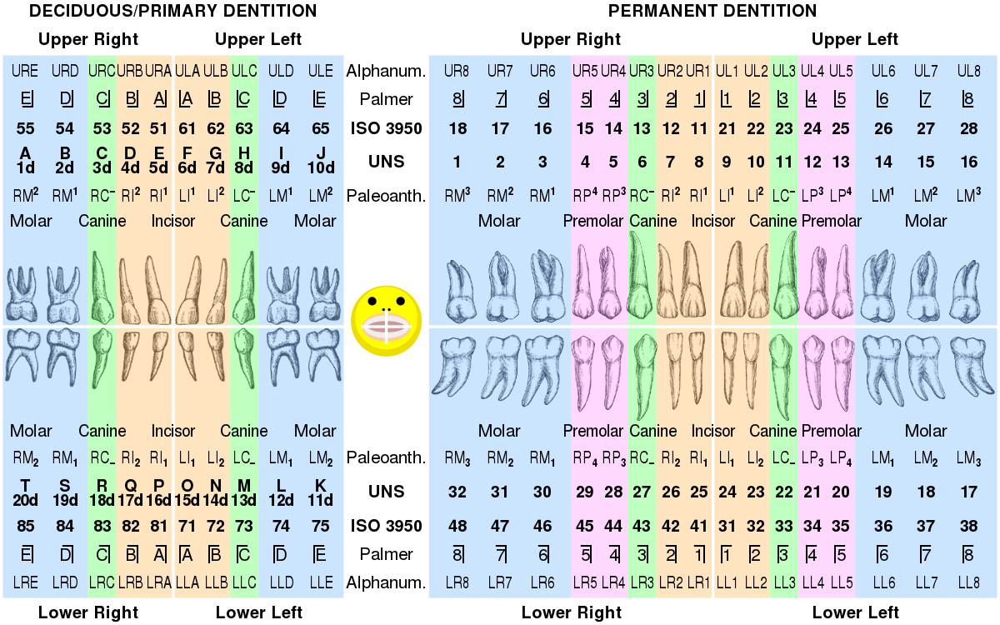

# Dental Notation

## Description
Dental professionals, in writing or speech, use several different dental notation systems for associating information with a specific tooth. The three most common systems are the ISO System (ISO 3950, the FDI World Dental Federation notation), Universal Numbering System, and Palmer notation method. The ISO system is used worldwide, and the Universal is used widely in the United States. The ISO System can be easily adapted to computerized charting.

A committee of the American Dental Association (ADA) recommended the use of the Palmer notation method in 1947. Since this method required the use of symbols, its use was difficult on keyboards. As a result, the association officially supported the Universal system in 1968. The World Health Organization and the Fédération Dentaire Internationale officially uses the two-digit numbering system of the FDI system. However, in 1996, the ADA adopted the ISO System as an alternative to the Universal System.

## ISO System aka FDI aka ISO 3950
The International Standards Organization Designation System (ISO System) by the World Health Organization notation system is widely used by dental professionals internationally to associate information with a specific tooth. Based on the Fédération Dentaire Internationale (FDI), it is also known as ISO 3950 notation. 

Thus the ISO System uses a two-digit numbering system in which the first digit represents a tooth's quadrant and the second digit represents the number of the tooth from the midline of the face. For permanent teeth, patient's upper right teeth begin with the number, "1". The upper left teeth begin with the number, "2". The lower left teeth begin with the number, "3". The lower right teeth begin with the number, "4".

## Universal Numbering System aka ADA aka UNS
Although it is termed "universal numbering system", it is most commonly used in the United States. It is also called the "American system". The uppercase letters A through T are used for primary teeth and the numbers 1 - 32 are used for permanent teeth. The tooth designated "1" is the maxillary right third molar ("wisdom tooth") and the count continues along the upper teeth to the left side. Then the count begins at the mandibular left third molar, designated number 17, and continues along the bottom teeth to the right side.

## Palmer
The Palmer notation is a system used by dentists to associate information with a specific tooth. Although supposedly superseded by the FDI World Dental Federation notation, it overwhelmingly continues to be the preferred method used by dental students and practitioners in the United Kingdom.

The Palmer notation consists of a symbol (┘└ ┐┌) designating the quadrant of the tooth and a number indicating the position from the midline. Adult teeth are numbered 1 to 8, with primary teeth indicated by a letter A to E. Hence the left and right maxillary central incisor would have the same number, "1", but the right one would have the symbol, "┘", underneath it, while the left one would have, "└".

## Comparison Chart

