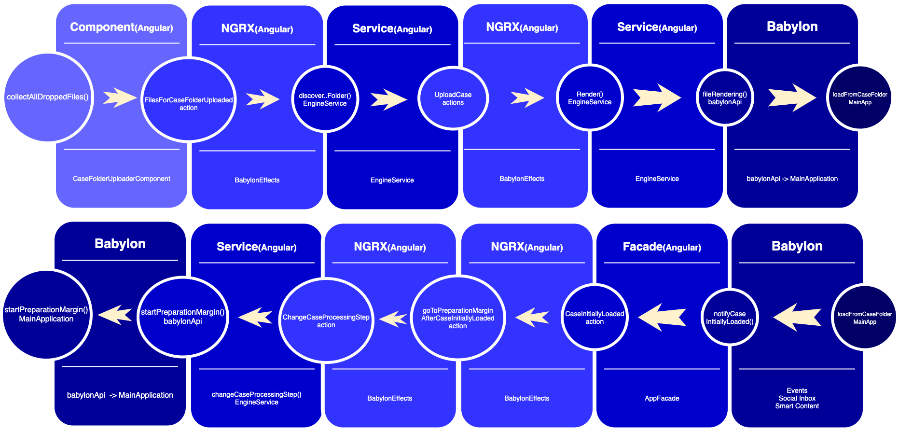

# Developer guide for Architecture

The backbone of the application is built upon the integration between:

* Angular UI components => [Angular 10.0](https://angular.io/)
* State management => [NgRx 10.0](https://ngrx.io/) 
* Babylon => [Babylon core 4.2](https://doc.babylonjs.com/) 

## Content plan:
* [Summary Angular](#summary-angular)
* [Summary State management](#summary-state-management)
* [Summary Babylon](#summary-babylon)
* [Communication between Angular and Babylon](#communication-between-angular-to-babylon)
    * [List of current BabylonApi methods](#list-of-current-babylonapi-methods)
* [Communication between Babylon and Angular](#communication-between-babylon-to-angular)
    * [List of current AppFacade methods](#list-of-current-appfacade-methods)
* [Diagram UI-State-Babylon-State-UI for uploading case flow](#fiagram-ui-state-babylon-state-ui-for-uploading-case-flow)

## Summary Angular:
Angular is one of the most popular design frameworks for creating an efficient single-page app, 
which combines UI (HTML + CSS) layer with the Business logic layer (.ts files).
That's why we use Angular for handling communication between User actions -> State -> Babylon.

Everything starts inside an Angular component, which is dispatching Actions to make a transition between States.
Connection to API, complex logic or architecture approaches are implemented inside Angular services.

## Summary State management:
At any stage of flow, the application has some set of data which should be stored somewhere to keep clear data flow.
State management is responsible to keep the memory of application (or state) and manage the transition between those states.
We use Ngrx library which is native Angular state management tools and give you a set of elements,
like: Actions, Reducers, Selectors, Effects to manage the data flow.
The structure element which combines those items into a single mechanism is called Store (/store folder)
Angular components communicate with Store by using Actions. Then Actions are handled by Reducers or Effects:
it depends on what is the type of effect of those actions.
[Useful link](https://medium.com/angular-in-depth/how-to-start-flying-with-angular-and-ngrx-b18e84d444aa#:~:text=NgRx%20is%20an%20open%20source,interact%20with%20a%20data%20store.)

## Summary Babylon:
TODO for JUAN

## Communication Angular to Babylon:
That communication is implemented by using [Adapter pattern](https://www.dofactory.com/javascript/design-patterns/adapter) - which is called BabylonApi (app/modules/rendering/index.ts).
So, Angular side is calling method from babylonApi which use method from Babylon side.
Example: look at 1st part of flow diagram

### List of current BabylonApi methods
TODO for Juan - prepare methods description
* fileRendering
* startPreparationMargin
* startInsertionAxis
* startCopyLine
* startContactAndThickness
* prepareResultExport
* updateCaseObjectsSettings

## Communication Babylon to Angular
That communication is implemented by using [Facade pattern](https://www.dofactory.com/javascript/design-patterns/facade) inside AppFacade file (app/facede/app-facade.ts).
So, Babylon side is calling appropriate method-callback which dispatch success action from State management.
Example: look at 2nd part of flow diagram

### List of current AppFacade methods
* sayHello - initial method for testing communication
* notifyCaseInitiallyLoaded - callback method for notifyong about successful case uploading
* export - method for exporting cases functionality

## Diagram UI-State-Babylon-State-UI for uploading case flow

