# Workflows

## Definitions
The following definitions apply for the workflow and the state machine respectively.

### State
TODO

#### Implementation Details
All state classes are using the Hollywood Principle (Don't call us, we call you!) by offering two `public` functions `onEnter()` and `onExit()` which call the respective `protected abstract _onEnter()` and `_onExit()` functions (see below).

All state classes are derived from the abstract class `State`, and have to implement the two `protected` class methods
* `_onEnter(): boolean`: called right before entering the state, and after the transition has finished - `false` leads to an immediate cancellation and a return to the previous state
* `_onExit(): boolean`: called right after leaving the state, and before starting a transition - `false` leads to an immediate cancellation and a return to the previous state

#### Nomenclature / Naming Convention
The state class names have a `State` postfix, e.g.
* `PreparationMarginEnteredState`
* `InsertionAxisCreatedState`

The file name is equal to the class name, e.g. `PreparationMarginEnteredState.ts`.

However, in the state diagrams below the `State` postfix is omitted for brevity.

### Transition
TODO

#### Implementation Details
All state classes are using the Hollywood Principle (Don't call us, we call you!) by offering two `public` functions `execute()` and `evaluate()` which call the respective `protected abstract _execute()` and `_evaluate()` functions (see below).

All transition classes are derived from the abstract class `Transition`, and have to implement the two `protected` class methods
* `_execute(): boolean`: called between to states during a state change - `false` leads to an immediate cancellation and a return to the previous state
* `_evaluate(): boolean`: a transition can be called at any time to determine whether it is currently a valid transition and whether it can then be executed - `true` indicates that the transition can be executed

#### Nomenclature / Naming Convention
The transition class names have a `Transition` postfix, and combine the two states by a `2` (meaningful abbreviations are allowed), e.g.
* `PrepMargin2InsertionAxisTransition`
* `InsertionAxis2CopyLineTransition`

The file name is equal to the class name, e.g. `PrepMargin2InsertionAxisTransition.ts`.

However, in the state diagrams below the `Transition` postfix is omitted for brevity.

#### Stereotypes
The transitions also have some predefined stereotypes to clarify their intended use:
* «automatic»: the previous state is a transient state, which automatically advances after a certain time (e.g. after executing an algorithm)
* «back»: the standard back on the main path (click on back button in the stepper menu)
* «double click»: a double left click in the 3D scene (usually for CAD tools)
* «fast backward»: forward to a previously visited state (click on a lower number in the stepper menu)
* «fast forward»: forward to a previously visited state, possible if the state is still valid (click on a higher number in the stepper menu)
* «mouse drag»: a mouse drag with the left mouse button in the 3D scene (usually for CAD tools)
* «next»: the standard next on the main path (click on nect button in the stepper menu)
* «start»: the very first transition after the app has started

### General Execution Order
The following execution order applies for a state change:

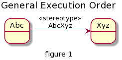
<!-- 
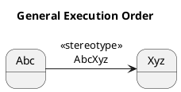
-->

Assuming the current state is `AbcState` and the new state is `XyzState`. The validity of a state change from `AbcState` to `XyzState` can be tested by `AbcXyzTransition.evaluate()`. After initiating the state change, the following execution order will be executed:

1. `AbcState.onExit()`
2. `AbcXyzTransition.execute()`
3. `XyzState.onEnter()`

## Angular Functionality
The following general functionality must be offered by Angular:
* General state machine or similar (as discussed) according the above rules (e.g. execution order, error handling, ...)
* Generic function to move from one state to another (for the «automatic» and «double click» transitions)

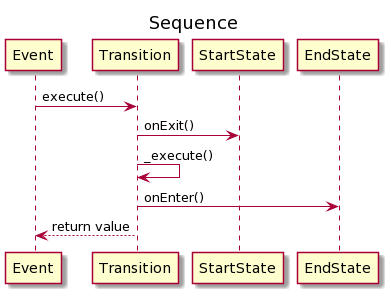
<!--
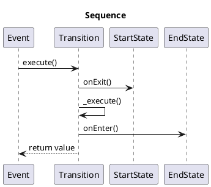
-->

The event could be either a click on a button, double click in the scene or through an internal event (e.g. finish calculating an algorithm).

## Copy Workflow
The copy mode copies the surface of an existing tooth at the same place. For this, the clinician has to scan the pre-oparation situation of the to be prepared place. This scan called pre-operation (or pre-op for short) or situation (or situ for short) or occlussion scan.

After preparing the tooth, a second scan has to be made which contains the actual preparation. This scan usually called preparation (or prep in short). Both scans can be from either the upper jaw or the lower jaw.

A third scan is optional. This scan contains the same place but from the opposing jaw. This scan usually called antagonist. This scan is normally used for the height of the restoration and is therefore not so important for the copy mode.

### Prerequisites
The prerequisites are:
* Pre-op and preparation scan from the same place from either the upper jaw or the lower jaw
* An **optional** third scan of the antagonist

### 1 Import
After starting the app, the state is `AppStarted`. Loading a case by any means leads to the `PreparationImported` state. This state automatically advances after the preparation is loaded.

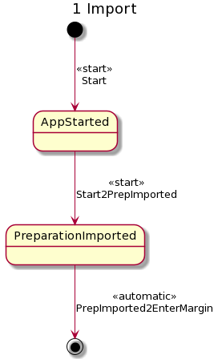
<!--
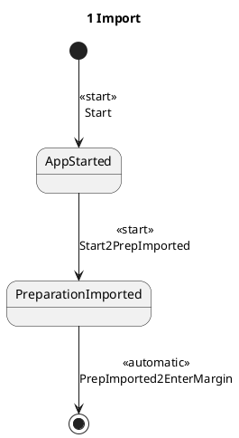
-->

### 2 Preparation Margin
After importing the jaws, the `EnterPreparationMargin` state automatically becomes the current state. After entering the preparation margin and finishing with a double left click, the current state becomes `PreparationMarginEntered`. From this state, there are multiple exits:
* To `CreateInsertionAxis` for going forward on the main path via `PrepMargin2CreateInsertionAxis`
* To `InsertionAxisCreated` for fast forward to the insertion axis via `PrepMargin2InsertionAxis`
* To `CopyLineCreated` for fast forward to the copy line via `PrepMargin2CopyLine`
* To `AppStarted` for fast backward to the initial app state (w/o a case loaded) via `PrepMargin2AppStarted`

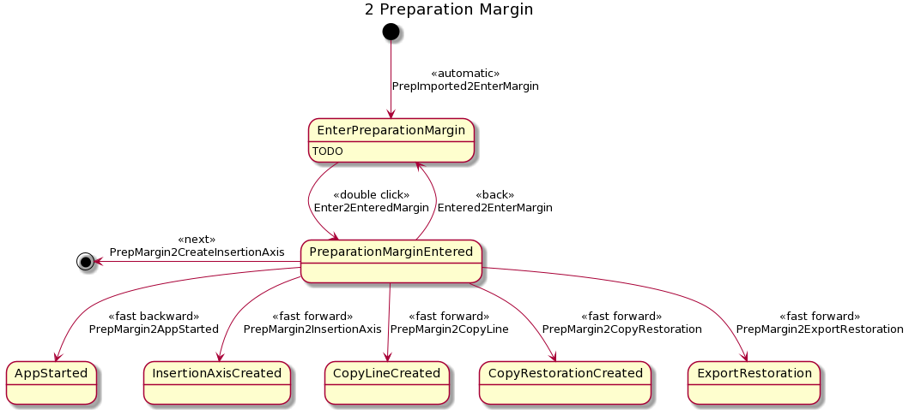
<!--
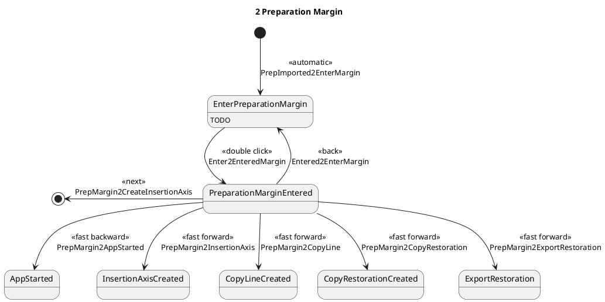
-->

### 3 Insertion Axis
The insertion axis proposal is calculated in state `CreateInsertionAxis`, and after calculating automatically advances to `InsertionAxisCreated`. With dragging in the 3D scene, the user is able to modify the insertion axis.

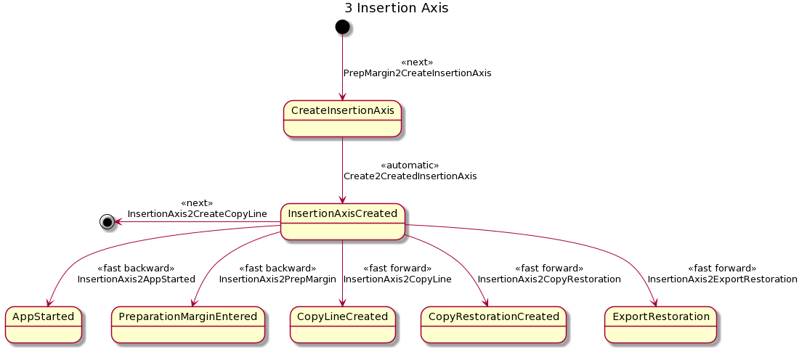
<!--
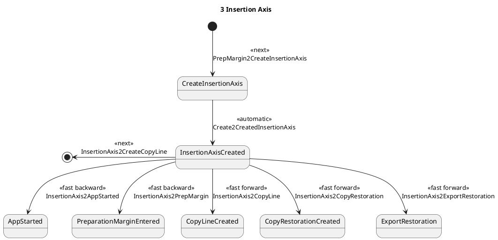
-->

### 4 Copy Line
The copy line proposal is calculated in state `CreateCopyLine`, and after calculating automatically advances to `CopyLineCreated`. With double clicking in the 3D scene, the user is able to modify the copy line.

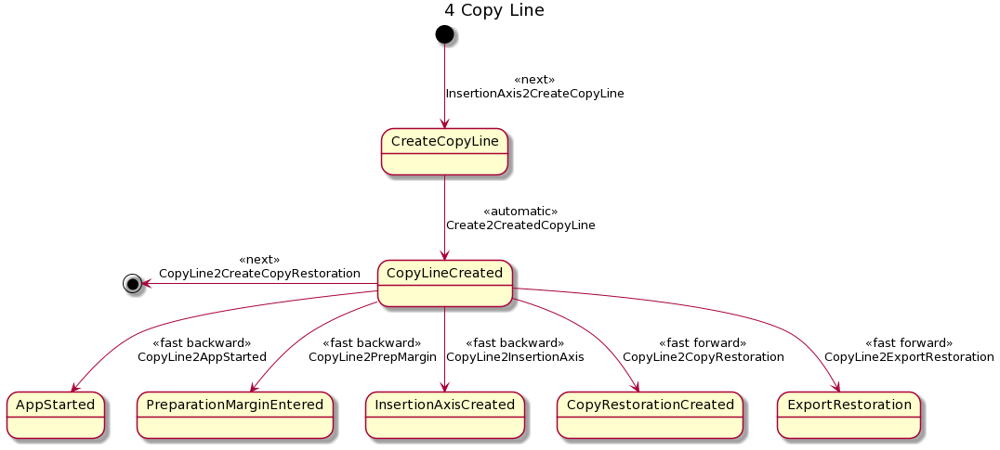
<!--
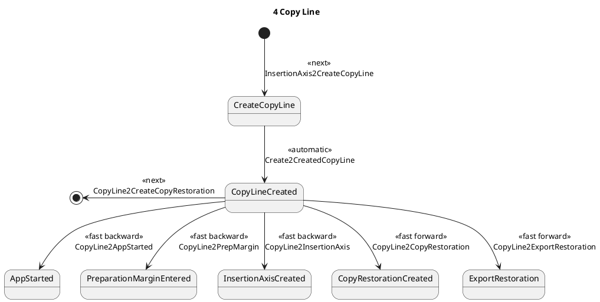
-->

### 5 Copy Restoration
The copy restoration proposal is calculated in state `CreateCopyRestoration`, and after calculating automatically advances to `CopyRestorationCreated`. Editing TBD.

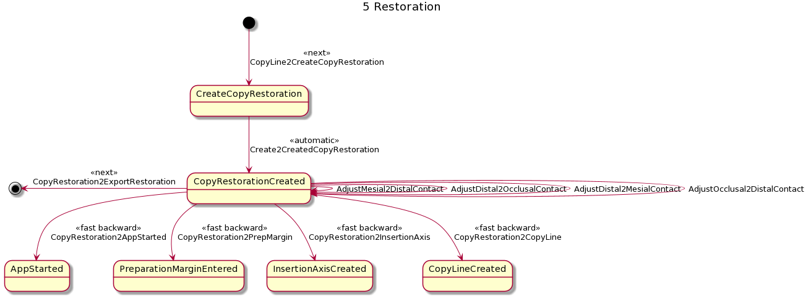
<!--
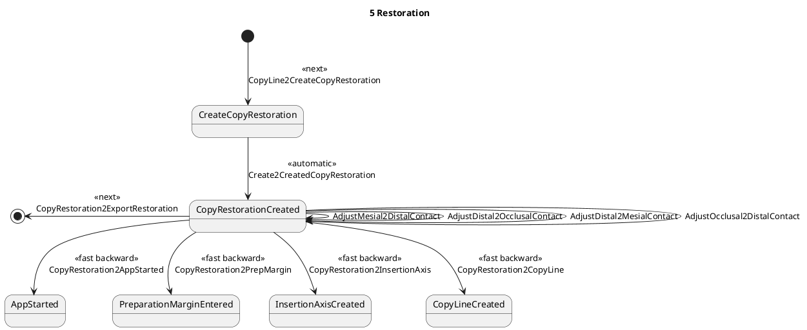
-->

### 6 Export Restoration
TODO / TBD

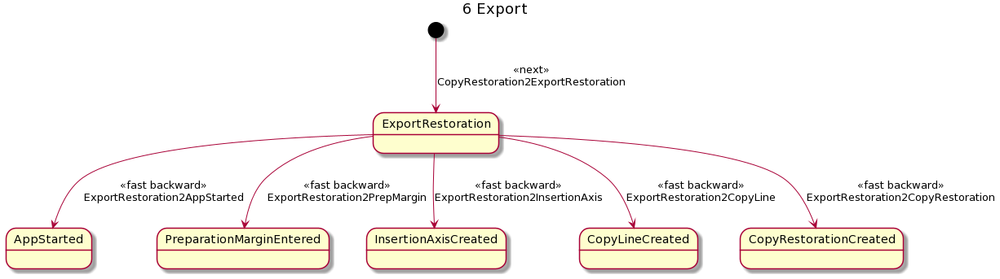
<!--
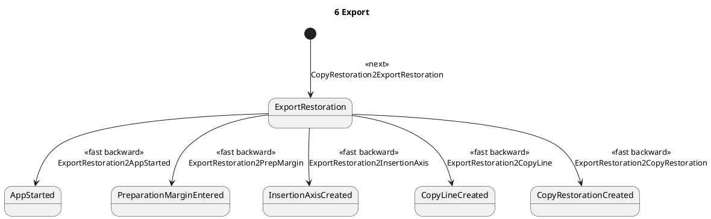
-->
